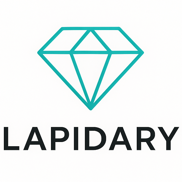

# Lapidary 

Build beautiful, interactive CLI/TUI applications in Crystal.

## Vision

Bring the elegance of Ruby syntax and the power of compiled binaries to terminal interface development. 

## The Lapidary Ecosystem

A jewel is cut into facets, placed in a setting, and shimmers in the light.

| Tool | Purpose |
|------|---------|
| Jewel 💎 | Core framework implementing The Elm Architecture |
| Facets 🔷 | Interactive components (lists, inputs, spinners) |
| Setting 💍 | Styling system (colors, borders, layout) |
| Shimmer 🌟 | Markdown rendering for beautiful help text |

## Status

🚧 **In Development** 

## Installation

_Coming soon_

## Quick Start

_Coming soon_

## License

MIT

Inspired by [Charmbracelet](https://github.com/charmbracelet)

